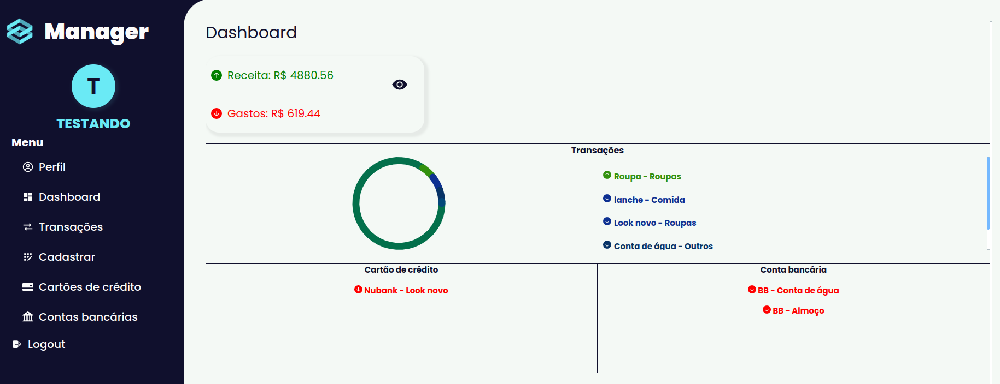

# Manager 

Web application for managing own finances.  <a href="https://manager-inky.vercel.app">Click to access</a>.Functionalities:
<li>-Login and user registration;</li>
<li>-Register transactions</li>
<li>-Register bank account</li>
<li>-Register Credit Card</li>
<li>-View Data</li>
<li>-Dashboard of your finances</li>



## Technologies
            
## How to run

1. Clone this repository
2. Install dependencies

```bash
npm i
```
3. Create .env according to .env.example
4. Create the migrations

```bash
npm run migrate
```
5. Run the project

```bash
npm run manager
```
